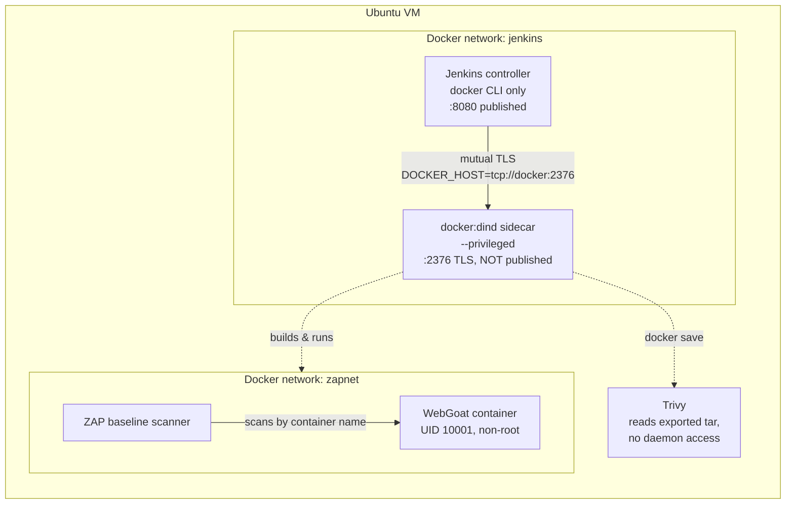

# secure-cicd-webgoat

Secure CI/CD pipeline for OWASP WebGoat — Jenkins on Docker-in-Docker with SCA, container scanning, and DAST stages, plus pipeline and container hardening.

> **On the target application:** [OWASP WebGoat](https://github.com/WebGoat/WebGoat) is a *deliberately insecure* application, maintained by OWASP as a security training tool. It is used here as the target-under-test: it guarantees the scanners have real findings to report, which is what makes the pipeline's output meaningful rather than a wall of green checkmarks. **Dependency alerts on this repository are expected and intentional.** WebGoat is never deployed anywhere reachable from an untrusted network.

---

## What this repository is

A CI/CD pipeline built to demonstrate that security controls belong *inside* the delivery process rather than bolted on afterwards. The application is incidental; the pipeline, and the reasoning behind its architecture, are the deliverable.

Every architectural decision below is documented with its trade-off. Where a more secure option was rejected, the reason is stated. Where residual risk was accepted, it is named rather than hidden.

---

## Architecture



Only port 8080 is published to the host. The Docker daemon's API is reachable exclusively over the internal network, authenticated with client certificates. The scanned application is never published at all — ZAP reaches it by container name on an isolated network.

---Threat model: [docs/THREAT_MODEL.md](docs/THREAT_MODEL.md)

## Pipeline stages

All eight stages verified passing.

| # | Stage | Purpose |
|---|---|---|
| 1 | Provenance | Records the exact commit under build |
| 2 | Build image | Multi-stage build of the hardened image |
| 3 | **Gate: non-root runtime** | Fails the build if the image would run as UID 0 |
| 4 | Export image | `docker save` to a tar for privilege-free scanning |
| 5 | SCA + image scan | Trivy: OS packages and Java dependencies, HTML report published |
| 6 | **Gate: base image CRITICALs** | Fails on fixable CRITICAL CVEs in the base image |
| 7 | DAST: ZAP baseline | Readiness-gated ZAP baseline scan, HTML + JSON reports |
| 8 | **Gate: DAST scan validity** | Fails if the scan produced *zero* findings |

Representative run: 56 passive rules executed, 21 URLs crawled, 11 finding classes reported against WebGoat, base image clean across 117 OS packages.

### The gates are the point

A pipeline that runs scanners and publishes reports is observability. A pipeline that *fails* is a control. Three gates enforce policy in code:

**Non-root runtime (stage 3)** extracts the effective UID from the built image and exits non-zero if it is 0. Policy enforced at build time rather than documented in a wiki.

**Base image CRITICALs (stage 6)** is deliberately scoped to `--pkg-types os` with `--ignore-unfixed`. This is the pipeline's most considered decision:

> WebGoat's application dependencies are *intentionally* vulnerable — they are the test corpus. A gate that blocked on them would fail every build, and would inevitably be switched off. So application dependencies are **reported but never blocked**, while base-image OS packages — a layer this project actually chooses and can upgrade — are **hard-gated**. The principle: *gate on what you control, report on what you don't.* `--ignore-unfixed` follows from the same logic, since failing a build over a CVE with no available patch only teaches people to bypass the gate.

**DAST scan validity (stage 8)** inverts the usual logic: it fails when ZAP reports **zero** findings. Against a deliberately vulnerable target, an empty result does not mean the application is secure — it means the scan never reached it (wrong URL, application not yet booted, spider blocked). A DAST stage that scans nothing and passes is a silent false negative, which is considerably more dangerous than an outright failure.

### Readiness gating, not `sleep`

Stage 7 polls WebGoat's Spring Boot actuator health endpoint from *inside* the scan network before ZAP starts, and aborts with application logs if readiness is never reached. A fixed `sleep` would either waste time or, worse, occasionally let ZAP scan a half-initialised application and report a clean result.

---

## Key design decisions

### Docker-in-Docker, not a mounted host socket

The common approach to giving Jenkins container-build capability is to bind-mount the host's `/var/run/docker.sock` into the Jenkins container. It is faster to set up, and it is also equivalent to granting unrestricted root on the host: any pipeline step can mount `/` or launch a privileged container in the host's namespace.

This pipeline instead runs a `docker:dind` sidecar with its own daemon, which Jenkins reaches over an internal Docker network. **The host's Docker socket is never exposed.**

*Trade-off, stated plainly:* the sidecar itself requires `--privileged`. This relocates the privilege boundary rather than eliminating it. The gain is that a compromised pipeline step reaches a disposable daemon instead of the host. This is also Jenkins' own officially documented Docker installation pattern.

### The daemon's API port is not published

An earlier iteration included `--publish 2376:2376` on the sidecar. It was removed.

Jenkins resolves the daemon by network alias (`tcp://docker:2376`); container-to-container traffic on a user-defined bridge requires no published port. The flag was functionally inert while binding the API of a privileged, root-equivalent daemon to the VM's LAN address. TLS client-certificate authentication mitigated it but did not justify it — publishing a privileged control plane to the local network directly contradicts the reason DinD was chosen in the first place.

### Scanners receive artifacts, not daemon access

Trivy scans an exported tar (`docker save` → `--input`) rather than being given access to the Docker daemon. A scanner that can query the daemon can also *drive* it. Passing a passive artifact means the scanner needs no privilege at all — the same reasoning that removed the published port, applied to tooling.

### TLS on the daemon channel, not plaintext 2375

`DOCKER_TLS_CERTDIR=/certs` causes the sidecar to generate a CA and require client certificates, so the control channel is mutually authenticated rather than anonymous. Jenkins mounts the certificate volume **read-only** — it consumes the certs and never writes them.

### Minimal Jenkins controller

The Docker CLI is copied from the `docker:cli` image via a multi-stage build rather than installed with `apt-get install docker.io`. The apt package would pull `containerd` and `runc` into the controller — a complete container runtime that is never used. The controller receives a Docker *client* and nothing else.

Plugins are pinned in a version-controlled `plugins.txt` and baked into the image, so the controller is reproducible and never patched live.

### No credentials where none are needed

The pipeline clones this public repository over HTTPS with no credential at all. A deploy key was considered and rejected: an unnecessary secret is a secret that has to be rotated, scoped, and audited for no benefit. Least privilege includes the privilege of holding no credential.

---

## Documented residual risk

Honest disclosure of what this architecture does *not* solve:

**Shared trust domain between Jenkins and the dind daemon.** The Jenkins home volume is mounted into the sidecar, because the daemon — not Jenkins — resolves the paths used when pipeline steps bind-mount `$WORKSPACE` into scanner containers. Removing the mount breaks every scanner stage.

The consequence: **Jenkins' credential store resides within the trust domain of a privileged daemon that pipeline steps can drive.** This is acceptable here because nothing untrusted executes — single repository, single maintainer, no builds from forked pull requests. It would not be acceptable in a shared CI environment.

*Production alternative:* ephemeral per-build agents, or rootless image builds via Kaniko or Buildah, removing the privileged daemon entirely.

**The privileged sidecar remains the highest-value target in this architecture.** Compromise of a pipeline step grants control of a privileged daemon. The mitigation is that the daemon is disposable and host-isolated, not that the risk is absent.

---

## Container hardening

Built as `Dockerfile.secure`, retained alongside the upstream `Dockerfile` so the two can be compared directly.

| Control | Implementation |
|---|---|
| Non-root runtime | Fixed numeric UID `10001` — verify with `docker run --rm --entrypoint id webgoat:secure` |
| No build toolchain in final image | Multi-stage build; Maven and the source tree stay in the discarded build stage (verified: no `mvn` in the runtime image) |
| Reproducible build | Maven runs *inside* the image build, requiring no host toolchain — unlike upstream, which expects a pre-built JAR to already exist on the host |
| Image vulnerability scanning | Trivy, gated (stages 5–6) |
| Read-only root filesystem | Evaluated — see below |

### Three findings worth recording

**A slim JRE base image was evaluated and rejected.** Several WebGoat lessons compile Java at runtime, so a JRE-only image breaks them — and breaks them *silently*, presenting as a broken application rather than a missing compiler. The full JDK is retained deliberately. Reducing image size at the cost of application correctness is not a security improvement.

**The upstream `HEALTHCHECK` was removed.** It invokes `curl`, which means shipping an HTTP client inside the runtime image — a convenient exfiltration primitive for very little benefit. The pipeline must wait for application readiness before DAST regardless, so the readiness probe lives in the Jenkinsfile where it is explicit and auditable, rather than buried in image metadata.

**A read-only root filesystem was scoped, not applied.** WebGoat writes lesson state beneath `-Duser.home=/home/webgoat`, so a blanket `--read-only` breaks user provisioning at startup. The correct implementation is a read-only root with a writable `tmpfs` mounted at that path specifically. Applying the flag without that mount would produce a container that looks hardened and does not run.

---

## Repository layout

```
Dockerfile.secure     # hardened multi-stage build (this project)
Dockerfile            # upstream WebGoat Dockerfile, retained for comparison
Jenkinsfile           # the eight-stage pipeline
.dockerignore         # rewritten for build-in-image workflow — see note
jenkins-image/
  Dockerfile          # minimal Jenkins controller
  plugins.txt         # pinned plugin set
```

**Note on `.dockerignore`:** upstream's excludes the entire source tree and re-includes only the pre-built JAR, which is correct for a build-on-host workflow and silently fatal for a build-in-image one. It reduced the build context to 8 kB and surfaced as `./mvnw: not found` — an error three steps removed from its cause. Rewritten here to exclude only build output, docs, and CI metadata. `.git` is retained intentionally, since Maven build-metadata plugins fail without it.

---

## Reproducing this

Requires a Linux host with Docker, ~40 GB free disk, and 8 GB RAM.

```bash
# 1. Network and volumes
docker network create jenkins
docker volume create jenkins-docker-certs
docker volume create jenkins-docker-data
docker volume create jenkins-data

# 2. Privileged dind sidecar — note: no published ports
docker run --name jenkins-docker --detach \
  --privileged --restart unless-stopped \
  --network jenkins --network-alias docker \
  --env DOCKER_TLS_CERTDIR=/certs \
  --volume jenkins-docker-certs:/certs/client \
  --volume jenkins-docker-data:/var/lib/docker \
  --volume jenkins-data:/var/jenkins_home \
  docker:dind --storage-driver overlay2

# 3. Build the controller image
cd jenkins-image && docker build -t jenkins-secure:local . && cd ..

# 4. Run the controller — only 8080 is published
docker run --name jenkins --detach \
  --restart unless-stopped \
  --network jenkins \
  --env DOCKER_HOST=tcp://docker:2376 \
  --env DOCKER_CERT_PATH=/certs/client \
  --env DOCKER_TLS_VERIFY=1 \
  --publish 8080:8080 \
  --volume jenkins-data:/var/jenkins_home \
  --volume jenkins-docker-certs:/certs/client:ro \
  jenkins-secure:local

# 5. Verify the daemon connection BEFORE anything else.
#    Must print both a Client: and a Server: section.
docker exec jenkins docker version

# 6. Pipeline prerequisites (on the dind daemon)
docker exec jenkins docker network create zapnet
docker exec jenkins docker volume create trivy-cache
docker exec jenkins docker pull aquasec/trivy:latest
docker exec jenkins docker pull ghcr.io/zaproxy/zaproxy:stable
docker exec jenkins docker pull curlimages/curl:latest

# 7. Initial admin password
docker exec jenkins cat /var/jenkins_home/secrets/initialAdminPassword
```

Then create a Pipeline job using **Pipeline script from SCM**, pointed at this repository with script path `Jenkinsfile`.

Step 5 is the one to not skip. The controller runs no daemon of its own, so a `Server:` block appearing at all proves three things simultaneously: the network alias resolved, mutual TLS succeeded, and the daemon API responded.

---
