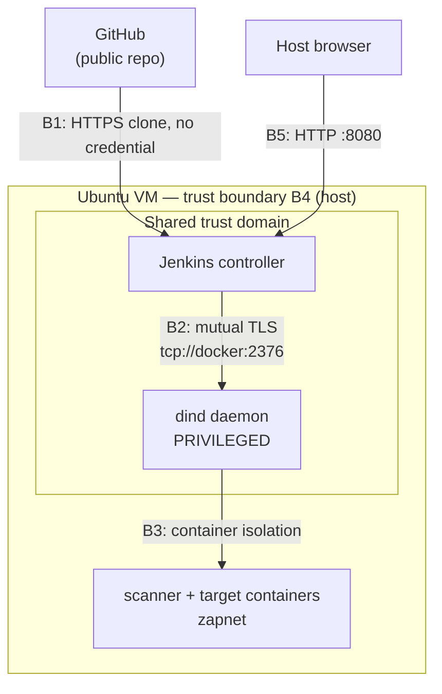

# Threat Model — secure-cicd-webgoat

STRIDE analysis of the CI/CD pipeline. **The asset under protection is the pipeline, not WebGoat.** WebGoat is deliberately vulnerable by design; modelling its application-layer flaws would be modelling the test fixture. What matters here is that a build system which compiles untrusted-ish code, runs scanners with elevated privilege, and produces deployable artifacts does not itself become the weakest link.

Scope: the Jenkins controller, the privileged `docker:dind` daemon, the scanner containers, the source repository, and the artifacts moving between them.

---

## 1. Assets

| Asset | Why it matters |
|---|---|
| dind daemon (privileged) | Root-equivalent within the VM. Highest-value target in the system. |
| Jenkins controller + `$JENKINS_HOME` | Holds job config, plugin set, `secrets/master.key`, `credentials.xml`. |
| Build artifact (`webgoat:secure-N`) | The output the pipeline vouches for. If it can be tampered with, every gate becomes theatre. |
| `Jenkinsfile` | Pipeline-as-code *is* execution. Whoever can write it can run arbitrary commands as the daemon. |
| Scan reports | The evidence trail. Silently altered or empty reports are worse than no reports. |
| The VM itself | Ultimate blast radius. |

---

## 2. Trust boundaries

- **B1 — GitHub → controller.** Inbound code. Crossed on every build.
- **B2 — controller → daemon.** *Authenticated but not a privilege boundary.* `$JENKINS_HOME` is mounted into the sidecar, so both sides share one trust domain. Documented and accepted, not solved.
- **B3 — daemon → containers.** Namespace isolation only. Weak by design: the daemon is privileged.
- **B4 — VM → host.** The boundary this architecture exists to protect. Only port 8080 crosses it.
- **B5 — browser → Jenkins.** **Plaintext HTTP.** The weakest boundary in the system (see S-2).

---

## 3. STRIDE

Ratings are qualitative — likelihood × impact in this specific deployment (single-user VM, no untrusted contributors, not internet-exposed).

### Spoofing

| ID | Threat | Existing control | Residual | Risk |
|---|---|---|---|---|
| S-1 | An attacker on the LAN impersonates the Docker daemon or issues API calls to it | Daemon port **not published**; reachable only on the internal bridge; mutual TLS with a generated CA | Requires prior code execution inside the `jenkins` network | **Low** |
| S-2 | Jenkins admin session hijacked or credentials sniffed | Form authentication, admin account | **Port 8080 is plaintext HTTP over a bridged LAN.** Session cookie and login POST are recoverable by anyone on the subnet | **Medium** — *highest-priority open item* |
| S-3 | Malicious image substituted for a legitimate base image | Pinned tag (`eclipse-temurin:25-jdk-noble`) | Tags are mutable; no digest pinning, no signature verification | **Medium** |

### Tampering

| ID | Threat | Existing control | Residual | Risk |
|---|---|---|---|---|
| T-1 | `Jenkinsfile` modified to insert arbitrary build steps | Pipeline-as-code in version control; diffs reviewable; commit recorded by the Provenance stage | **No branch protection and no required review.** A push to `main` is immediate arbitrary execution | **Medium** |
| T-2 | Build artifact altered between build and scan | Scans read a `docker save` tar produced in the same stage sequence; immutable per-build tag `secure-N` | No signing or attestation; artifact isn't cryptographically bound to its scan result | **Low** |
| T-3 | Scan report altered to hide findings | Reports archived per-build by Jenkins | Written to a workspace writable by every scanner container running as root | **Low** |
| T-4 | Dependency substitution during the Maven build (typosquat / repo poisoning) | Upstream `pom.xml` with pinned versions | No checksum or signature verification of resolved dependencies | **Medium** |

### Repudiation

| ID | Threat | Existing control | Residual | Risk |
|---|---|---|---|---|
| R-1 | Cannot establish what code produced a given artifact | Provenance stage prints the built commit; build logs retained (10 builds); immutable per-build tags | Log rotation discards history after 10 builds; no signed attestation | **Low** |
| R-2 | Cannot attribute a pipeline change to a person | Git commit authorship | Author fields are self-asserted; commits unsigned | **Low** |

### Information disclosure

| ID | Threat | Existing control | Residual | Risk |
|---|---|---|---|---|
| I-1 | Credentials extracted from `$JENKINS_HOME` | Nothing untrusted executes; **no credentials are currently stored** — the repo is public and cloned anonymously | `$JENKINS_HOME` is mounted into the privileged sidecar, so any pipeline step can read `master.key` and `credentials.xml`. Currently low-impact only because the store is empty | **Medium** *(would be High the moment a real secret is added)* |
| I-2 | Secrets leaked into build logs | No secrets in the pipeline; no `echo` of environment | `sh` steps run with `set -x`, so any future credential passed as an argument would be printed verbatim | **Medium** |
| I-3 | WebGoat reachable by an unintended party | Target container has **no published ports**; reachable only on `zapnet` | An attacker already on the VM can reach a deliberately vulnerable app | **Low** |
| I-4 | Jenkins UI exposed on the LAN | `ufw` available; bridged network only | Plaintext HTTP, LAN-reachable — same root cause as S-2 | **Medium** |

### Denial of service

| ID | Threat | Existing control | Residual | Risk |
|---|---|---|---|---|
| D-1 | Build exhausts VM disk (images, layers, Trivy DB) | Per-build tag removed in `post`; `image.tar` deleted; build discarder keeps 10 builds | No quota on `/var/lib/docker`; caches grow unbounded | **Medium** |
| D-2 | Hung build blocks the pipeline indefinitely | `timeout(45, MINUTES)` at pipeline level; ZAP spider capped with `-m 2` | Single-agent, so one build blocks all others | **Low** |
| D-3 | Memory exhaustion from concurrent JVMs (Maven + WebGoat + ZAP) | Stages run sequentially; `-DskipTests` removes the heaviest JVM; 4 GB swap as OOM backstop | No container memory limits set | **Low** |

### Elevation of privilege

| ID | Threat | Existing control | Residual | Risk |
|---|---|---|---|---|
| **E-1** | **Container escape from the privileged dind daemon to the VM** | Daemon is containerised and disposable; host `/var/run/docker.sock` is **never** mounted; no host filesystem bind-mounts | **`--privileged` is inherent to DinD.** Escape from the sidecar means root on the VM | **High** — *accepted, architecturally inherent* |
| E-2 | Malicious pipeline step drives the privileged daemon | Only trusted code executes; no forked-PR builds | Any `sh` step has full daemon access — including `docker run --privileged -v /:/host` | **Medium** (bounded by T-1) |
| E-3 | Compromise of the application container escalates further | Runs as UID 10001, gated in CI; no toolchain in the runtime image; no published ports | No dropped capabilities, no `--read-only`, no seccomp profile beyond the default | **Low** |
| E-4 | Host Docker socket abused | **Not applicable — the socket is never mounted.** This is the threat the entire DinD decision was made to eliminate | — | **Eliminated** |

---

## 4. Findings, ranked

**E-1 — privileged dind daemon (High, accepted).** Structural, not a defect. Root-equivalent within the VM if escaped. Accepted because the alternative — mounting the host's Docker socket — is *strictly worse*: it grants root on the host directly, with no escape required. The gain is real even though the risk is not eliminated: the blast radius moves from the host to a disposable VM-scoped container.
*To eliminate rather than relocate:* rootless builds with Kaniko or Buildah, removing the daemon entirely. That is the correct production answer.

**S-2 / I-4 — plaintext HTTP on port 8080 (Medium, open).** The most fixable real weakness. Admin session cookies traverse a bridged LAN in cleartext. Mitigation is a TLS-terminating reverse proxy in front of Jenkins, or binding to localhost and tunnelling over SSH. Not done — acknowledged rather than hidden.

**T-1 — no branch protection (Medium, open).** `Jenkinsfile` is executable code, and a direct push to `main` runs arbitrary commands with daemon access. Mitigation: protect `main`, require PR review, treat pipeline changes as code changes. Trivial to enable; appropriate to skip on a single-maintainer repo, and the *first* thing to enable with a second contributor.

**I-1 — credential store in the sidecar's trust domain (Medium, conditional).** Currently low-impact because no secrets exist. The moment a registry credential or deploy key is added, this becomes High. Mitigation: an external secret store, or ephemeral agents that never share a volume with the daemon.

**S-3 / T-4 — no digest pinning or dependency verification (Medium, open).** Mutable tags and unverified Maven artifacts are both supply-chain exposure. Mitigation: pin base images by `sha256` digest, enable dependency checksum verification, and generate an SBOM per build (Trivy already produces one with `--format cyclonedx`).

**D-1 — unbounded cache growth (Medium, operational).** Manageable by monitoring, but it will eventually fill the disk. Mitigation: a scheduled `docker builder prune --filter until=168h` rather than the per-build prune, which was found to destroy the Maven layer cache.

---

## 5. What this model deliberately excludes

- **WebGoat's application vulnerabilities.** Intentional and in scope as *scanner input*, not as findings against this project.
- **VMware and host OS hardening.** Below this system's boundary.
- **Physical and insider threat.** Single-operator lab environment.
- **Availability SLOs.** No availability requirement for a demonstration pipeline.

---

## 6. Method note

STRIDE per-element, walking the trust boundaries in §2. It is a design-time artifact, reviewed when the architecture changes — deliberately *not* an automated pipeline stage. Threat modelling asks whether the design is sound; automation checks whether an implementation matches a known-bad pattern. A build step cannot tell you that mounting `$JENKINS_HOME` into a privileged sidecar collapses a trust boundary.

Every High and Medium finding above is either mitigated with a stated control, or accepted with a stated reason and a named production alternative.
# Threat Model — secure-cicd-webgoat

STRIDE analysis of the CI/CD pipeline. **The asset under protection is the pipeline, not WebGoat.** WebGoat is deliberately vulnerable by design; modelling its application-layer flaws would be modelling the test fixture. What matters here is that a build system which compiles untrusted-ish code, runs scanners with elevated privilege, and produces deployable artifacts does not itself become the weakest link.

Scope: the Jenkins controller, the privileged `docker:dind` daemon, the scanner containers, the source repository, and the artifacts moving between them.

---

## 1. Assets

| Asset | Why it matters |
|---|---|
| dind daemon (privileged) | Root-equivalent within the VM. Highest-value target in the system. |
| Jenkins controller + `$JENKINS_HOME` | Holds job config, plugin set, `secrets/master.key`, `credentials.xml`. |
| Build artifact (`webgoat:secure-N`) | The output the pipeline vouches for. If it can be tampered with, every gate becomes theatre. |
| `Jenkinsfile` | Pipeline-as-code *is* execution. Whoever can write it can run arbitrary commands as the daemon. |
| Scan reports | The evidence trail. Silently altered or empty reports are worse than no reports. |
| The VM itself | Ultimate blast radius. |

---

## 2. Trust boundaries

- **B1 — GitHub → controller.** Inbound code. Crossed on every build.
- **B2 — controller → daemon.** *Authenticated but not a privilege boundary.* `$JENKINS_HOME` is mounted into the sidecar, so both sides share one trust domain. Documented and accepted, not solved.
- **B3 — daemon → containers.** Namespace isolation only. Weak by design: the daemon is privileged.
- **B4 — VM → host.** The boundary this architecture exists to protect. Only port 8080 crosses it.
- **B5 — browser → Jenkins.** **Plaintext HTTP.** The weakest boundary in the system (see S-2).

---

## 3. STRIDE

Ratings are qualitative — likelihood × impact in this specific deployment (single-user VM, no untrusted contributors, not internet-exposed).

### Spoofing

| ID | Threat | Existing control | Residual | Risk |
|---|---|---|---|---|
| S-1 | An attacker on the LAN impersonates the Docker daemon or issues API calls to it | Daemon port **not published**; reachable only on the internal bridge; mutual TLS with a generated CA | Requires prior code execution inside the `jenkins` network | **Low** |
| S-2 | Jenkins admin session hijacked or credentials sniffed | Form authentication, admin account | **Port 8080 is plaintext HTTP over a bridged LAN.** Session cookie and login POST are recoverable by anyone on the subnet | **Medium** — *highest-priority open item* |
| S-3 | Malicious image substituted for a legitimate base image | Pinned tag (`eclipse-temurin:25-jdk-noble`) | Tags are mutable; no digest pinning, no signature verification | **Medium** |

### Tampering

| ID | Threat | Existing control | Residual | Risk |
|---|---|---|---|---|
| T-1 | `Jenkinsfile` modified to insert arbitrary build steps | Pipeline-as-code in version control; diffs reviewable; commit recorded by the Provenance stage | **No branch protection and no required review.** A push to `main` is immediate arbitrary execution | **Medium** |
| T-2 | Build artifact altered between build and scan | Scans read a `docker save` tar produced in the same stage sequence; immutable per-build tag `secure-N` | No signing or attestation; artifact isn't cryptographically bound to its scan result | **Low** |
| T-3 | Scan report altered to hide findings | Reports archived per-build by Jenkins | Written to a workspace writable by every scanner container running as root | **Low** |
| T-4 | Dependency substitution during the Maven build (typosquat / repo poisoning) | Upstream `pom.xml` with pinned versions | No checksum or signature verification of resolved dependencies | **Medium** |

### Repudiation

| ID | Threat | Existing control | Residual | Risk |
|---|---|---|---|---|
| R-1 | Cannot establish what code produced a given artifact | Provenance stage prints the built commit; build logs retained (10 builds); immutable per-build tags | Log rotation discards history after 10 builds; no signed attestation | **Low** |
| R-2 | Cannot attribute a pipeline change to a person | Git commit authorship | Author fields are self-asserted; commits unsigned | **Low** |

### Information disclosure

| ID | Threat | Existing control | Residual | Risk |
|---|---|---|---|---|
| I-1 | Credentials extracted from `$JENKINS_HOME` | Nothing untrusted executes; **no credentials are currently stored** — the repo is public and cloned anonymously | `$JENKINS_HOME` is mounted into the privileged sidecar, so any pipeline step can read `master.key` and `credentials.xml`. Currently low-impact only because the store is empty | **Medium** *(would be High the moment a real secret is added)* |
| I-2 | Secrets leaked into build logs | No secrets in the pipeline; no `echo` of environment | `sh` steps run with `set -x`, so any future credential passed as an argument would be printed verbatim | **Medium** |
| I-3 | WebGoat reachable by an unintended party | Target container has **no published ports**; reachable only on `zapnet` | An attacker already on the VM can reach a deliberately vulnerable app | **Low** |
| I-4 | Jenkins UI exposed on the LAN | `ufw` available; bridged network only | Plaintext HTTP, LAN-reachable — same root cause as S-2 | **Medium** |

### Denial of service

| ID | Threat | Existing control | Residual | Risk |
|---|---|---|---|---|
| D-1 | Build exhausts VM disk (images, layers, Trivy DB) | Per-build tag removed in `post`; `image.tar` deleted; build discarder keeps 10 builds | No quota on `/var/lib/docker`; caches grow unbounded | **Medium** |
| D-2 | Hung build blocks the pipeline indefinitely | `timeout(45, MINUTES)` at pipeline level; ZAP spider capped with `-m 2` | Single-agent, so one build blocks all others | **Low** |
| D-3 | Memory exhaustion from concurrent JVMs (Maven + WebGoat + ZAP) | Stages run sequentially; `-DskipTests` removes the heaviest JVM; 4 GB swap as OOM backstop | No container memory limits set | **Low** |

### Elevation of privilege

| ID | Threat | Existing control | Residual | Risk |
|---|---|---|---|---|
| **E-1** | **Container escape from the privileged dind daemon to the VM** | Daemon is containerised and disposable; host `/var/run/docker.sock` is **never** mounted; no host filesystem bind-mounts | **`--privileged` is inherent to DinD.** Escape from the sidecar means root on the VM | **High** — *accepted, architecturally inherent* |
| E-2 | Malicious pipeline step drives the privileged daemon | Only trusted code executes; no forked-PR builds | Any `sh` step has full daemon access — including `docker run --privileged -v /:/host` | **Medium** (bounded by T-1) |
| E-3 | Compromise of the application container escalates further | Runs as UID 10001, gated in CI; no toolchain in the runtime image; no published ports | No dropped capabilities, no `--read-only`, no seccomp profile beyond the default | **Low** |
| E-4 | Host Docker socket abused | **Not applicable — the socket is never mounted.** This is the threat the entire DinD decision was made to eliminate | — | **Eliminated** |

---

## 4. Findings, ranked

**E-1 — privileged dind daemon (High, accepted).** Structural, not a defect. Root-equivalent within the VM if escaped. Accepted because the alternative — mounting the host's Docker socket — is *strictly worse*: it grants root on the host directly, with no escape required. The gain is real even though the risk is not eliminated: the blast radius moves from the host to a disposable VM-scoped container.
*To eliminate rather than relocate:* rootless builds with Kaniko or Buildah, removing the daemon entirely. That is the correct production answer.

**S-2 / I-4 — plaintext HTTP on port 8080 (Medium, open).** The most fixable real weakness. Admin session cookies traverse a bridged LAN in cleartext. Mitigation is a TLS-terminating reverse proxy in front of Jenkins, or binding to localhost and tunnelling over SSH. Not done — acknowledged rather than hidden.

**T-1 — no branch protection (Medium, open).** `Jenkinsfile` is executable code, and a direct push to `main` runs arbitrary commands with daemon access. Mitigation: protect `main`, require PR review, treat pipeline changes as code changes. Trivial to enable; appropriate to skip on a single-maintainer repo, and the *first* thing to enable with a second contributor.

**I-1 — credential store in the sidecar's trust domain (Medium, conditional).** Currently low-impact because no secrets exist. The moment a registry credential or deploy key is added, this becomes High. Mitigation: an external secret store, or ephemeral agents that never share a volume with the daemon.

**S-3 / T-4 — no digest pinning or dependency verification (Medium, open).** Mutable tags and unverified Maven artifacts are both supply-chain exposure. Mitigation: pin base images by `sha256` digest, enable dependency checksum verification, and generate an SBOM per build (Trivy already produces one with `--format cyclonedx`).

**D-1 — unbounded cache growth (Medium, operational).** Manageable by monitoring, but it will eventually fill the disk. Mitigation: a scheduled `docker builder prune --filter until=168h` rather than the per-build prune, which was found to destroy the Maven layer cache.

---

## 5. What this model deliberately excludes

- **WebGoat's application vulnerabilities.** Intentional and in scope as *scanner input*, not as findings against this project.
- **VMware and host OS hardening.** Below this system's boundary.
- **Physical and insider threat.** Single-operator lab environment.
- **Availability SLOs.** No availability requirement for a demonstration pipeline.

---

## 6. Method note

STRIDE per-element, walking the trust boundaries in §2. It is a design-time artifact, reviewed when the architecture changes — deliberately *not* an automated pipeline stage. Threat modelling asks whether the design is sound; automation checks whether an implementation matches a known-bad pattern. A build step cannot tell you that mounting `$JENKINS_HOME` into a privileged sidecar collapses a trust boundary.

Every High and Medium finding above is either mitigated with a stated control, or accepted with a stated reason and a named production alternative.
# Threat Model — secure-cicd-webgoat

STRIDE analysis of the CI/CD pipeline. **The asset under protection is the pipeline, not WebGoat.** WebGoat is deliberately vulnerable by design; modelling its application-layer flaws would be modelling the test fixture. What matters here is that a build system which compiles untrusted-ish code, runs scanners with elevated privilege, and produces deployable artifacts does not itself become the weakest link.

Scope: the Jenkins controller, the privileged `docker:dind` daemon, the scanner containers, the source repository, and the artifacts moving between them.

---

## 1. Assets

| Asset | Why it matters |
|---|---|
| dind daemon (privileged) | Root-equivalent within the VM. Highest-value target in the system. |
| Jenkins controller + `$JENKINS_HOME` | Holds job config, plugin set, `secrets/master.key`, `credentials.xml`. |
| Build artifact (`webgoat:secure-N`) | The output the pipeline vouches for. If it can be tampered with, every gate becomes theatre. |
| `Jenkinsfile` | Pipeline-as-code *is* execution. Whoever can write it can run arbitrary commands as the daemon. |
| Scan reports | The evidence trail. Silently altered or empty reports are worse than no reports. |
| The VM itself | Ultimate blast radius. |

---

## 2. Trust boundaries

- **B1 — GitHub → controller.** Inbound code. Crossed on every build.
- **B2 — controller → daemon.** *Authenticated but not a privilege boundary.* `$JENKINS_HOME` is mounted into the sidecar, so both sides share one trust domain. Documented and accepted, not solved.
- **B3 — daemon → containers.** Namespace isolation only. Weak by design: the daemon is privileged.
- **B4 — VM → host.** The boundary this architecture exists to protect. Only port 8080 crosses it.
- **B5 — browser → Jenkins.** **Plaintext HTTP.** The weakest boundary in the system (see S-2).

---

## 3. STRIDE

Ratings are qualitative — likelihood × impact in this specific deployment (single-user VM, no untrusted contributors, not internet-exposed).

### Spoofing

| ID | Threat | Existing control | Residual | Risk |
|---|---|---|---|---|
| S-1 | An attacker on the LAN impersonates the Docker daemon or issues API calls to it | Daemon port **not published**; reachable only on the internal bridge; mutual TLS with a generated CA | Requires prior code execution inside the `jenkins` network | **Low** |
| S-2 | Jenkins admin session hijacked or credentials sniffed | Form authentication, admin account | **Port 8080 is plaintext HTTP over a bridged LAN.** Session cookie and login POST are recoverable by anyone on the subnet | **Medium** — *highest-priority open item* |
| S-3 | Malicious image substituted for a legitimate base image | Pinned tag (`eclipse-temurin:25-jdk-noble`) | Tags are mutable; no digest pinning, no signature verification | **Medium** |

### Tampering

| ID | Threat | Existing control | Residual | Risk |
|---|---|---|---|---|
| T-1 | `Jenkinsfile` modified to insert arbitrary build steps | Pipeline-as-code in version control; diffs reviewable; commit recorded by the Provenance stage | **No branch protection and no required review.** A push to `main` is immediate arbitrary execution | **Medium** |
| T-2 | Build artifact altered between build and scan | Scans read a `docker save` tar produced in the same stage sequence; immutable per-build tag `secure-N` | No signing or attestation; artifact isn't cryptographically bound to its scan result | **Low** |
| T-3 | Scan report altered to hide findings | Reports archived per-build by Jenkins | Written to a workspace writable by every scanner container running as root | **Low** |
| T-4 | Dependency substitution during the Maven build (typosquat / repo poisoning) | Upstream `pom.xml` with pinned versions | No checksum or signature verification of resolved dependencies | **Medium** |

### Repudiation

| ID | Threat | Existing control | Residual | Risk |
|---|---|---|---|---|
| R-1 | Cannot establish what code produced a given artifact | Provenance stage prints the built commit; build logs retained (10 builds); immutable per-build tags | Log rotation discards history after 10 builds; no signed attestation | **Low** |
| R-2 | Cannot attribute a pipeline change to a person | Git commit authorship | Author fields are self-asserted; commits unsigned | **Low** |

### Information disclosure

| ID | Threat | Existing control | Residual | Risk |
|---|---|---|---|---|
| I-1 | Credentials extracted from `$JENKINS_HOME` | Nothing untrusted executes; **no credentials are currently stored** — the repo is public and cloned anonymously | `$JENKINS_HOME` is mounted into the privileged sidecar, so any pipeline step can read `master.key` and `credentials.xml`. Currently low-impact only because the store is empty | **Medium** *(would be High the moment a real secret is added)* |
| I-2 | Secrets leaked into build logs | No secrets in the pipeline; no `echo` of environment | `sh` steps run with `set -x`, so any future credential passed as an argument would be printed verbatim | **Medium** |
| I-3 | WebGoat reachable by an unintended party | Target container has **no published ports**; reachable only on `zapnet` | An attacker already on the VM can reach a deliberately vulnerable app | **Low** |
| I-4 | Jenkins UI exposed on the LAN | `ufw` available; bridged network only | Plaintext HTTP, LAN-reachable — same root cause as S-2 | **Medium** |

### Denial of service

| ID | Threat | Existing control | Residual | Risk |
|---|---|---|---|---|
| D-1 | Build exhausts VM disk (images, layers, Trivy DB) | Per-build tag removed in `post`; `image.tar` deleted; build discarder keeps 10 builds | No quota on `/var/lib/docker`; caches grow unbounded | **Medium** |
| D-2 | Hung build blocks the pipeline indefinitely | `timeout(45, MINUTES)` at pipeline level; ZAP spider capped with `-m 2` | Single-agent, so one build blocks all others | **Low** |
| D-3 | Memory exhaustion from concurrent JVMs (Maven + WebGoat + ZAP) | Stages run sequentially; `-DskipTests` removes the heaviest JVM; 4 GB swap as OOM backstop | No container memory limits set | **Low** |

### Elevation of privilege

| ID | Threat | Existing control | Residual | Risk |
|---|---|---|---|---|
| **E-1** | **Container escape from the privileged dind daemon to the VM** | Daemon is containerised and disposable; host `/var/run/docker.sock` is **never** mounted; no host filesystem bind-mounts | **`--privileged` is inherent to DinD.** Escape from the sidecar means root on the VM | **High** — *accepted, architecturally inherent* |
| E-2 | Malicious pipeline step drives the privileged daemon | Only trusted code executes; no forked-PR builds | Any `sh` step has full daemon access — including `docker run --privileged -v /:/host` | **Medium** (bounded by T-1) |
| E-3 | Compromise of the application container escalates further | Runs as UID 10001, gated in CI; no toolchain in the runtime image; no published ports | No dropped capabilities, no `--read-only`, no seccomp profile beyond the default | **Low** |
| E-4 | Host Docker socket abused | **Not applicable — the socket is never mounted.** This is the threat the entire DinD decision was made to eliminate | — | **Eliminated** |

---

## 4. Findings, ranked

**E-1 — privileged dind daemon (High, accepted).** Structural, not a defect. Root-equivalent within the VM if escaped. Accepted because the alternative — mounting the host's Docker socket — is *strictly worse*: it grants root on the host directly, with no escape required. The gain is real even though the risk is not eliminated: the blast radius moves from the host to a disposable VM-scoped container.
*To eliminate rather than relocate:* rootless builds with Kaniko or Buildah, removing the daemon entirely. That is the correct production answer.

**S-2 / I-4 — plaintext HTTP on port 8080 (Medium, open).** The most fixable real weakness. Admin session cookies traverse a bridged LAN in cleartext. Mitigation is a TLS-terminating reverse proxy in front of Jenkins, or binding to localhost and tunnelling over SSH. Not done — acknowledged rather than hidden.

**T-1 — no branch protection (Medium, open).** `Jenkinsfile` is executable code, and a direct push to `main` runs arbitrary commands with daemon access. Mitigation: protect `main`, require PR review, treat pipeline changes as code changes. Trivial to enable; appropriate to skip on a single-maintainer repo, and the *first* thing to enable with a second contributor.

**I-1 — credential store in the sidecar's trust domain (Medium, conditional).** Currently low-impact because no secrets exist. The moment a registry credential or deploy key is added, this becomes High. Mitigation: an external secret store, or ephemeral agents that never share a volume with the daemon.

**S-3 / T-4 — no digest pinning or dependency verification (Medium, open).** Mutable tags and unverified Maven artifacts are both supply-chain exposure. Mitigation: pin base images by `sha256` digest, enable dependency checksum verification, and generate an SBOM per build (Trivy already produces one with `--format cyclonedx`).

**D-1 — unbounded cache growth (Medium, operational).** Manageable by monitoring, but it will eventually fill the disk. Mitigation: a scheduled `docker builder prune --filter until=168h` rather than the per-build prune, which was found to destroy the Maven layer cache.

---

## 5. What this model deliberately excludes

- **WebGoat's application vulnerabilities.** Intentional and in scope as *scanner input*, not as findings against this project.
- **VMware and host OS hardening.** Below this system's boundary.
- **Physical and insider threat.** Single-operator lab environment.
- **Availability SLOs.** No availability requirement for a demonstration pipeline.

---

## 6. Method note

STRIDE per-element, walking the trust boundaries in §2. It is a design-time artifact, reviewed when the architecture changes — deliberately *not* an automated pipeline stage. Threat modelling asks whether the design is sound; automation checks whether an implementation matches a known-bad pattern. A build step cannot tell you that mounting `$JENKINS_HOME` into a privileged sidecar collapses a trust boundary.

Every High and Medium finding above is either mitigated with a stated control, or accepted with a stated reason and a named production alternative.

